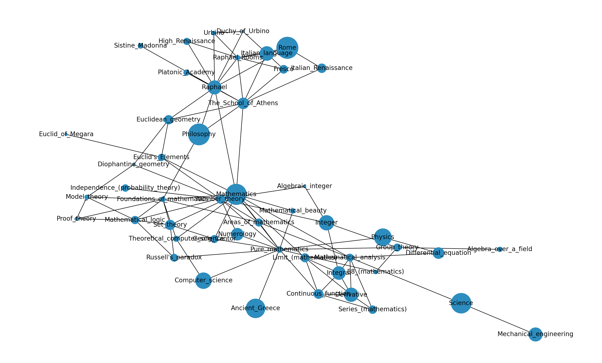

# wikimap
<h2>Wikipedia Mapping Tools</h2>
  
Iteratively map wikipedia page connections from a start page.

Graphically represent with NetworkX or custom network visualisation tools.
   

Example: 10 links collected per page, 3 pages deep, starting on mathematics, pruning nodes with < 10 connections, graphing using NetworkX:

